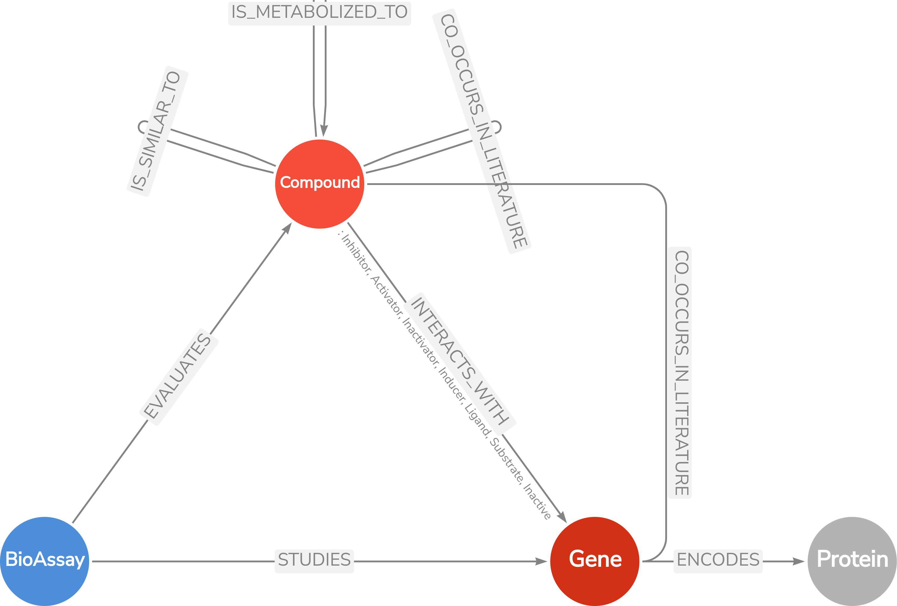

# Welcome to ChemGraphBuilder    [](https://doi.org/10.5281/zenodo.13237900)

The `chemgraphbuilder` package is a specialized tool designed for researchers in bioinformatics, cheminformatics, and computational biology. It enables the construction of detailed knowledge graphs that map the complex interactions between chemical compounds, genes, proteins, and bioassays. These knowledge graphs are critical for visualizing and understanding the multifaceted relationships in biochemical networks.

At its core, `chemgraphbuilder` integrates data from PubChem and utilize Neo4j, creating nodes that represent key entities such as compounds, genes, proteins, and bioassays. It further enriches these graphs by incorporating various relationships, including:

- **BioAssay-Compound Relationships**: Capturing the interactions where bioassays evaluate the effects of specific compounds. This is crucial for understanding the efficacy and mechanism of action of pharmaceuticals.
- **BioAssay-Gene Relationships**: Documenting instances where bioassays study specific genes, providing valuable data on gene function and regulation.
- **Gene-Protein Relationships**: Mapping the connections where genes encode proteins, providing insights into genetic regulation and protein function.
- **Compound-Gene Interactions**: Detailing how compounds interact with genes, categorized into various interaction types such as Inhibitors, Inactivators, Activators, Inducers, Substrates, Ligands, and Inactive compounds. This classification aids in understanding gene regulation, drug mechanisms, and potential therapeutic applications.
- **Compound Similarities**: Highlighting chemical similarities between compounds, which can suggest similar biological activities or shared molecular properties.
- **Compound Co-occurrence**: Identifying instances where compounds or genes co-occur in scientific literature, indicating potential interactions or co-regulation.

---

The `chemgraphbuilder` package is versatile and can be utilized both in Python code and via the command line interface. For practical examples and use cases, please refer to the "Usage Examples" section available in the menu on the left sidebar. For comprehensive documentation of the main classes and their functionalities, visit [the Documentation Page](https://asmaa-a-abdelwahab.github.io/ChemGraphBuilder/documentation/).

---

## Neo4j Requirements

`chemgraphbuilder` requires a running **Neo4j** database that is accessible via **Bolt URI**, **username**, and **password**.

You can run Neo4j:
- **Locally** (Neo4j Desktop or Docker)
- **Remotely** (Neo4j Aura Cloud)

**Default Bolt port:** `7687`  
**Default Web UI port:** `7474`

---

## 🚀 Quick Start

Follow these steps to get up and running with `chemgraphbuilder` and Neo4j in under 5 minutes.

### 1️⃣ Install and Run Neo4j

**Option A – Docker (fastest)**
```bash
docker run \
  --name neo4j \
  -p 7474:7474 -p 7687:7687 \
  -e NEO4J_AUTH=neo4j/testpassword \
  neo4j:5.14
```

* Bolt URI: `bolt://localhost:7687`
* Username: `neo4j`
* Password: `testpassword`
* Web UI: [http://localhost:7474](http://localhost:7474)

**Option B – Neo4j Desktop**

1. Download from: [https://neo4j.com/download/](https://neo4j.com/download/)
2. Create a **new project** and database.
3. Note the **Bolt URI**, **username**, and **password**.


### 2️⃣ Install `chemgraphbuilder`

```bash
pip install chemgraphbuilder
```
Or visit the [PyPI Project Page](https://pypi.org/project/chemgraphbuilder) for the latest release.


### 3️⃣ Connect to Neo4j in Python

```python
from chemgraphbuilder import Neo4jBase

# Connection details
NEO4J_URI = "bolt://localhost:7687"
NEO4J_USER = "neo4j"
NEO4J_PASSWORD = "testpassword"

# Connect and test
db = Neo4jBase(uri=NEO4J_URI, user=NEO4J_USER, password=NEO4J_PASSWORD)
db.test_connection()
```

---

### 4️⃣ First Example

```python
# Create a simple test node
db.run_query("CREATE (:Test {name: 'Hello Neo4j'})")
print("Node created!")
```

Check in the Neo4j Browser:

```cypher
MATCH (n) RETURN n;
```

---
## Project layout

    chemgraphbuilder/                 # Main source code directory for the chemgraphbuilder package.
    build/
        lib/chemgraphbuilder/         # Build artifacts and main package files.
    chemgraphbuilder.egg-info/        # Package metadata and distribution information.
    dist/                             # Distribution packages (.tar.gz, .whl).
    docs/                             # Documentation files for the project.
        index.md                      # Documentation homepage.
        ...                           # Other markdown pages, images, and files.
    examples/                         # Example scripts and usage demonstrations.
    __pycache__/                      # Compiled Python bytecode files.
    .gitignore                        # Specifies files and directories to be ignored by Git.
    LICENSE                           # License file detailing the terms of use.
    README.md                         # Project overview and instructions.
    mkdocs.yml                        # Configuration file for MkDocs.
    requirements.txt                  # List of Python dependencies for the project.
    setup.py                          # Setup script for packaging and distribution.
            
## Gallery

Welcome to the gallery. Here are some screenshots from the Knowledge Graph built using this package:

<div id="carouselExample" class="carousel slide" data-ride="carousel">
  <div class="carousel-inner">
    <div class="carousel-item active">
      
    </div>
    <div class="carousel-item">
      
    </div>
    <div class="carousel-item">
      
    </div>
    <div class="carousel-item">
      
    </div>
    <div class="carousel-item">
      
    </div>
    <div class="carousel-item">
      
    </div>
  </div>
  <a class="carousel-control-prev" href="#carouselExample" role="button" data-slide="prev">
    <span class="carousel-control-prev-icon" aria-hidden="true"></span>
    <span class="sr-only">Previous</span>
  </a>
  <a class="carousel-control-next" href="#carouselExample" role="button" data-slide="next">
    <span class="carousel-control-next-icon" aria-hidden="true"></span>
    <span class="sr-only">Next</span>
  </a>
</div>

