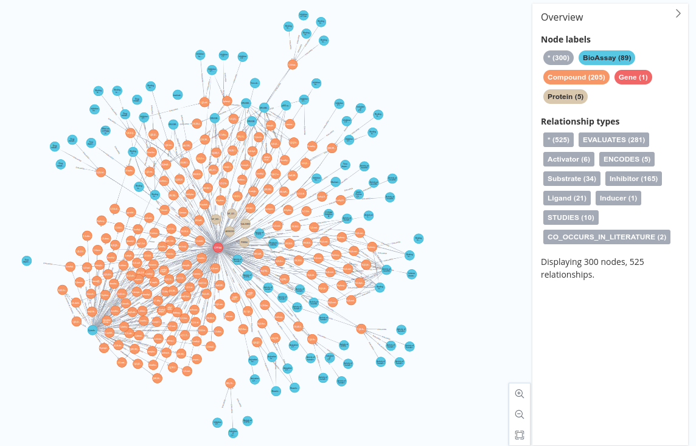

# Welcome to MkDocs

For full documentation visit [mkdocs.org](https://www.mkdocs.org).

## Commands

* `mkdocs new [dir-name]` - Create a new project.
* `mkdocs serve` - Start the live-reloading docs server.
* `mkdocs build` - Build the documentation site.
* `mkdocs -h` - Print help message and exit.

## Project layout

    mkdocs.yml    # The configuration file.
    docs/
        index.md  # The documentation homepage.
        ...       # Other markdown pages, images and other files.
        
## Gallery

Welcome to the gallery. Here are some screenshots from the Knowledge Graph built using this package:

  

    

      
    

    

      
    

    

      
    

    

      
    

    

      
    

  

  <a class="carousel-control-prev" href="#carouselExample" role="button" data-slide="prev">
    
    Previous
  </a>
  <a class="carousel-control-next" href="#carouselExample" role="button" data-slide="next">
    
    Next
  </a>

